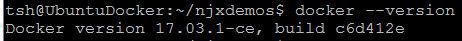
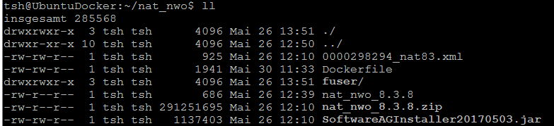
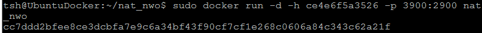
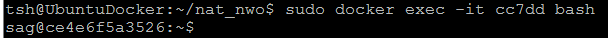
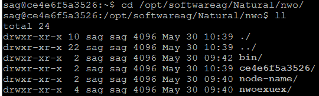
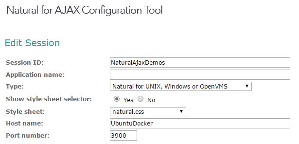
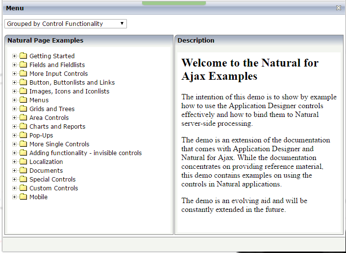
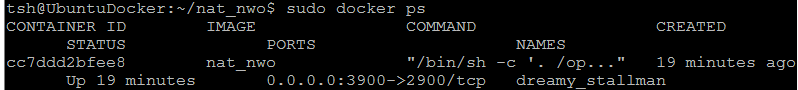
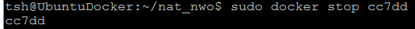

##### Thomas Schwade - May 30, 2017

## Running a Natural Web I/O server in a Docker Container

### Why Docker?

In a recent article I have summarized the role that Docker can play in the DevOps concept and demonstrated this with a Natural Ajax application as an example. But also Natural itself can be deployed an run in a Docker container and I will show this in the following.

When running Natural, we can think of different scenarios:

- An interactive Natural development environment
- A Natural Development Server (NDV)
- A Natural Web I/O Server (NWO)

In the following I will show how to set up a Natural Web I/O Server in a Docker container, since this is the natural extension to the Natural AJAX example shown earlier.

### What do we want to achieve?

We start at the point where "usually" the job of the developers ends and the job of the operating people starts. That is to say: We have a readily built Natural application. For the sake of this example, we assume that we have this application built into a dedicated user system file (FUSER) and want to deploy it together with the required infrastructure (Natural Runtime and Natural Web I/O Server) in a Docker container. 

### A playground for the first steps

First of all we need a machine where Docker is installed. For this example I used an Oracle VirtualBox VM, running Ubuntu 16.04. On this VM I installed Docker as described in [https://docs.docker.com/engine/installation/linux/ubuntu/](https://docs.docker.com/engine/installation/linux/ubuntu/ "https://docs.docker.com/engine/installation/linux/ubuntu/")

We check if Docker is correctly installed:

### Preparing the Natural installation image

We assume that we have downloaded the Software AG installer into our working directory *nat_nwo* and that we have also a valid license file in that directory.

Then we run

	java -jar SoftwareAGInstaller20170503.jar -writeImage nat_nwo_8.3.8.zip -console
 
to create the installation image.

### Preparing the Natural installation script

Run

	java -jar SoftwareAGInstaller20170503.jar -readImage nat_nwo_8.3.8.zip -editScript nat_nwo_8.3.8 -console
 
to create the installation script. To my experience, it is not possible to create the image and the script in one step.

### Providing the application

We copy the user system file containing our application also into the working directory nat_nwo.

### Creating the container

Now we need to specify our *Dockerfile*.

As infrastructure for our application we need a slimmed Linux operating system. [Docker Hub](https://hub.docker.com/) provides a lot of ready made images that we can use to build our container. We specify our container in the so-called *Dockerfile*.

As a basis for our new container we use the image ubuntu:16.04 from [Docker Hub](https://hub.docker.com/)

Contents of *Dockerfile*:

	# For this example we take an Ubuntu image as basis.
	FROM ubuntu:16.04

	# This is optional. There are many other LABELs possible.
	LABEL maintainer "thomas.schwade@zerodrive.net"

	# We need Java to run the Software AG installer. 
	# This is only used during the installation.
	# The Natural installation brings its own Java with it.
	RUN apt-get update && \
    	apt-get install -y openjdk-8-jdk

	# Create the user sag under which we will run the Natural installation.
	RUN useradd -ms /bin/bash sag && \
    	echo 'sag:sag' | chpasswd && \
	    mkdir /opt/softwareag && \
    	chown -R sag:sag /opt/softwareag

	# Provide the NWO port to the external world.
	EXPOSE 2900

	# We need these files for the Natural installation.
	USER sag
	WORKDIR /home/sag
	# The installer.
	COPY SoftwareAGInstaller20170503.jar /home/sag
	# The installation image.
	COPY nat_nwo_8.3.8.zip /home/sag
	# The installation script.
	COPY nat_nwo_8.3.8 /home/sag 
	# The license file.
	# Make sure not only that your license file matches the platform,
	# but also that your usage is within the license terms.
	COPY 0000298294_nat83.xml /home/sag

	# Now run the Natural installation.
	RUN java -jar SoftwareAGInstaller20170503.jar -readScript nat_nwo_8.3.8 -readImage nat_nwo_8.3.8.zip -console

	# Run the post-installation script.
	USER root
	RUN /opt/softwareag/bin/afterInstallAsRoot.sh

	# Exchange the default fuser with the one that contains our application.
	COPY fuser /opt/softwareag/Natural/fuser
	RUN chown -R sag:sag /opt/softwareag/Natural/fuser
	RUN chmod 777 /opt/softwareag/Natural/nwo/ce4e6f5a3526/nwo.sh

	# Everything up to this point is run when the container is built.
	# The following command is run when the container is executed.

	# Set the Natural environment and start the NWO server.
	USER sag
	CMD . /opt/softwareag/Natural/INSTALL/natenv && \
    	/opt/softwareag/Natural/bin/natstart.bsh && \
    	/opt/softwareag/Natural/INSTALL/sag1nwosrvd start && \
	    sleep infinity

We build the container:

	sudo docker build --no-cache -t nat_nwo .

The builder executes the steps in the Dockerfile and creates the new container. It stores intermediate build results in a cache. If we later need to rebuild the container, we can omit the --no-cache option, so that unchanged intermediate build results are reused.

### Running the container

Now we can deploy and run the container: 

Now the container is running in its own virtual machine.

What does the parameter -p 3900:2900 mean? The Natural Web I/O Server exposes by default a TCP port 2900. With the parameter -p 3900:2900 we map that port on the port 3900 on the *host* machine (here: *UbuntuDocker*). Thus we can access our Natural Web I/O Server under the host name UbuntuDocker and the port 3900.

A remark to the parameter -h ce4e6f5a3526: When we connect to our container with 

we see that the Natural installation has created a NWO host directory with the name ce4e6f5a3526:
 

This is the hostname under which we need to run the container to make the NWO server work.

### Testing the container

In my example I have loaded the Natural programs of the Natural Ajax Demo application into the container. Having the Natural Ajax Demo application .war file on a Tomcat on a different machine, I can now configure the web application to use the Natural Web I/O Server in the Docker container:

and run the application in the browser:

### Listing running containers

With the command *docker ps* we can list the running containers:

### Stopping the running container

With the command *docker stop* we can stop the running container. We specify the container id that was displayed after startup, or we get the id from the docker ps command. We need not specify the complete id, only a part that makes it unique:

### What have we achieved so far?

We have packaged our Natural application together with the required infrastructure into a container that can be deployed and run on any physical or virtual machine where Docker is installed. We were able to specify the configuration of the infrastructure in textual form (as a Dockerfile), so we used the concept of "infrastructure as code". 

### What comes next?

The next step will obviously be combining our two containers *njxdemos* and *nat_nwo* to a service stack, so that we have both components of the application *dockerized*. But this will be described in another article.

  

 